<p align="center">
  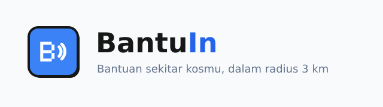
</p>

# BantuIn

Demo: <https://bantuin.naithef.my.id>

BantuIn adalah papan bantuan mikro untuk warga kos. Penghuni memposting
permintaan tolong berskala kecil, tetangga terdekat mengambilnya, dan yang
membantu mengumpulkan poin Karma yang bisa ditukar dengan reward. Ada juga
tombol darurat yang mengabari seluruh tetangga dalam radius satu kilometer.

## Daftar isi

1. [Penjelasan aplikasi](#penjelasan-aplikasi)
2. [Tampilan aplikasi](#tampilan-aplikasi)
3. [Teknologi yang digunakan](#teknologi-yang-digunakan)
4. [Fitur utama](#fitur-utama)
5. [Cara instalasi](#cara-instalasi)
6. [Cara penggunaan](#cara-penggunaan)
7. [Struktur proyek](#struktur-proyek)
8. [Cara kerja backend](#cara-kerja-backend)
9. [Bagian simulasi dan bagian nyata](#bagian-simulasi-dan-bagian-nyata)
10. [Batasan yang diketahui](#batasan-yang-diketahui)

## Penjelasan aplikasi

### Latar belakang

Anak kos umumnya tinggal jauh dari keluarga dan nyaris tidak mengenal
penghuni lain di bangunan yang sama. Masalah yang muncul kecil tapi mendesak:
jemuran ketinggalan di luar saat hujan turun, paket yang perlu diambil, charger
rusak semalam sebelum ujian, atau kondisi darurat jam dua pagi tanpa ada orang
yang bisa dihubungi. Grup chat memang ada, tapi permintaan tolong di sana
tenggelam dalam hitungan menit dan tidak ada cara tahu siapa yang posisinya
cukup dekat untuk membantu.

Tetangga sebenarnya bersedia menolong. Yang belum ada adalah tempat supaya
permintaan kecil itu terlihat oleh orang yang memang dekat secara fisik, dan
alasan yang membuat orang mau menjawabnya.

### Tujuan

BantuIn dibangun dengan empat tujuan.

1. Membuat permintaan tolong hanya terlihat oleh tetangga yang cukup dekat
   untuk menanggapinya, diurutkan berdasarkan jarak, bukan disebar ke semua
   orang.
2. Memberi imbalan berupa poin Karma, papan peringkat, dan katalog reward,
   supaya menolong jadi kebiasaan, bukan sekali dua kali saja.
3. Menyediakan jalur darurat yang sampai ke tetangga terdekat dalam hitungan
   detik, tanpa tenggelam seperti di grup chat.
4. Menjaga model datanya aman sejak awal, sehingga tidak ada pengguna yang bisa
   membaca lokasi, chat pribadi, atau notifikasi pengguna lain.

Proyek ini sejalan dengan SDG 11 (Kota dan Komunitas Berkelanjutan) karena
memperkuat unit komunitas kota yang paling kecil, yaitu orang-orang yang
tinggal di jalan yang sama.

## Tampilan aplikasi

### Masuk dan pendaftaran

| Layar sambutan | Masuk | Daftar |
| --- | --- | --- |
| 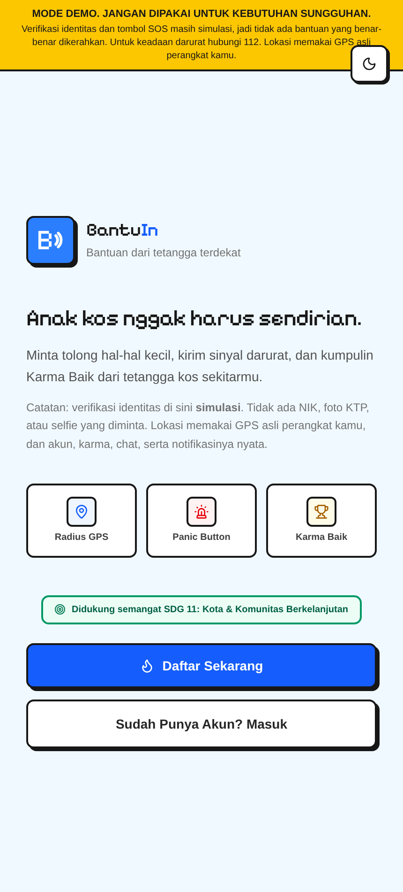 | 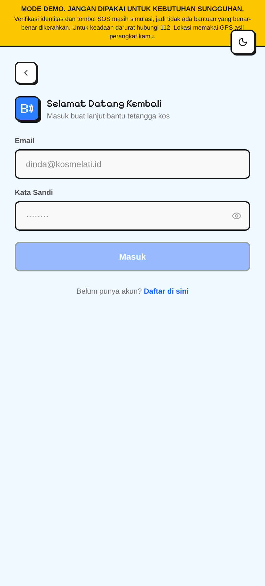 | 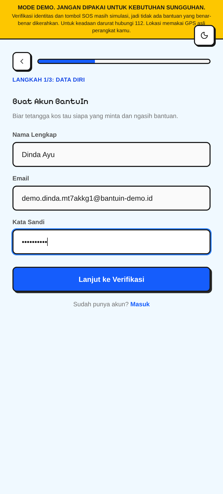 |

| Verifikasi simulasi | Akun siap dipakai |
| --- | --- |
| 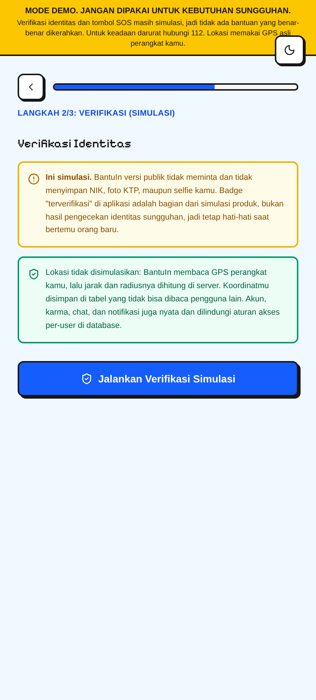 | 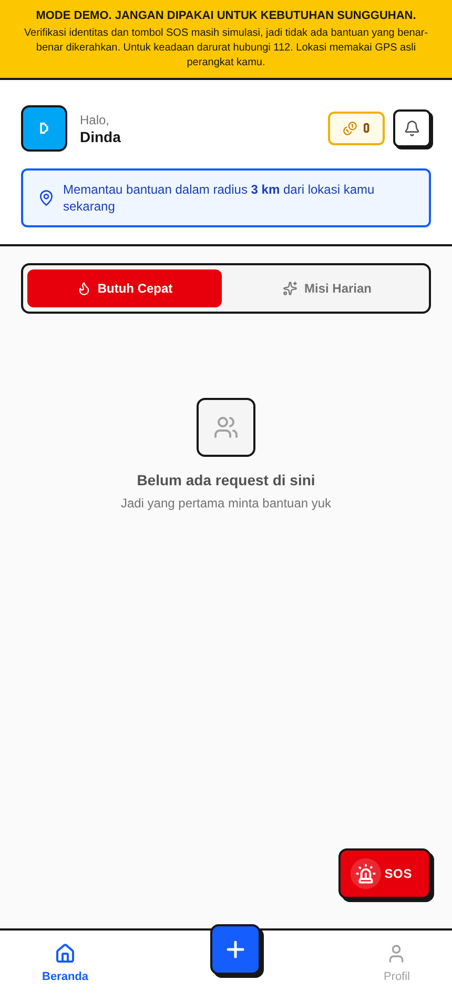 |

### Feed bantuan

| Beranda, tab Butuh Cepat | Tab Misi Harian | Buat request |
| --- | --- | --- |
| 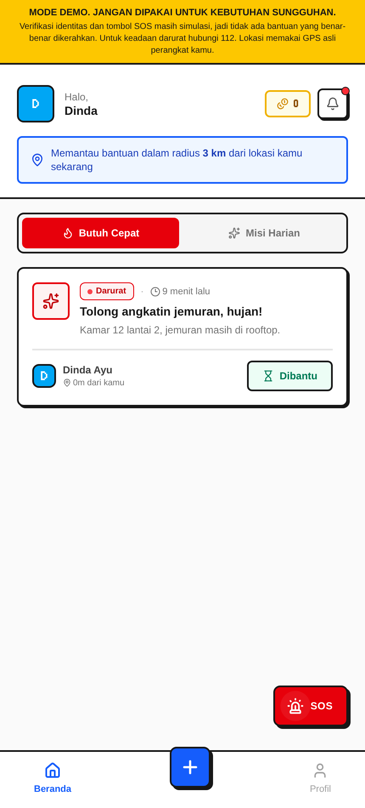 | 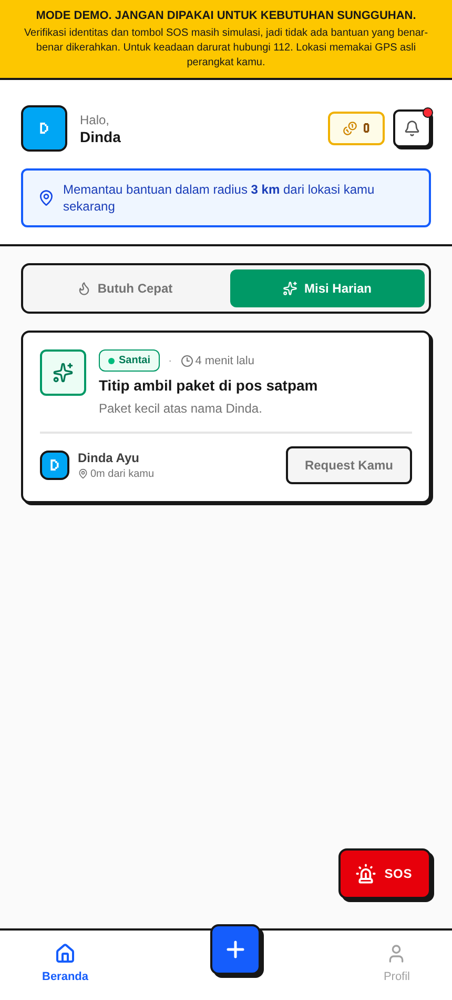 | 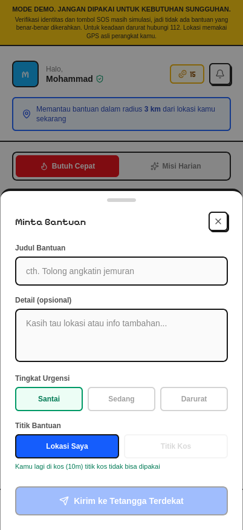 |

### Detail request

| Detail dan peta | Menunggu konfirmasi | Konfirmasi selesai |
| --- | --- | --- |
| 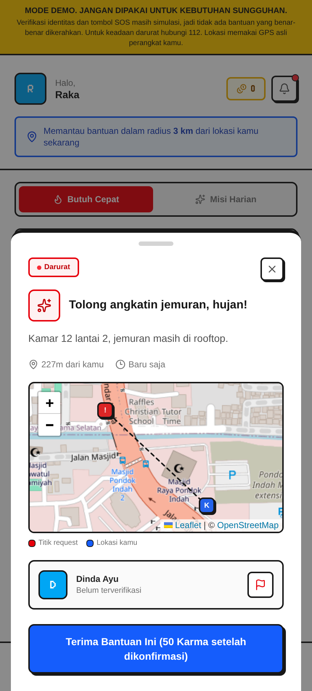 | 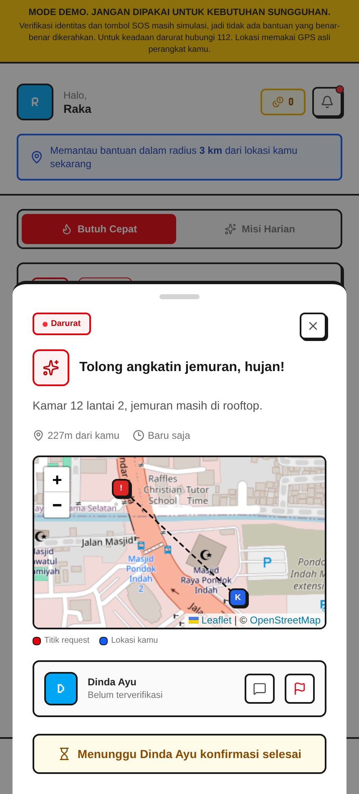 | 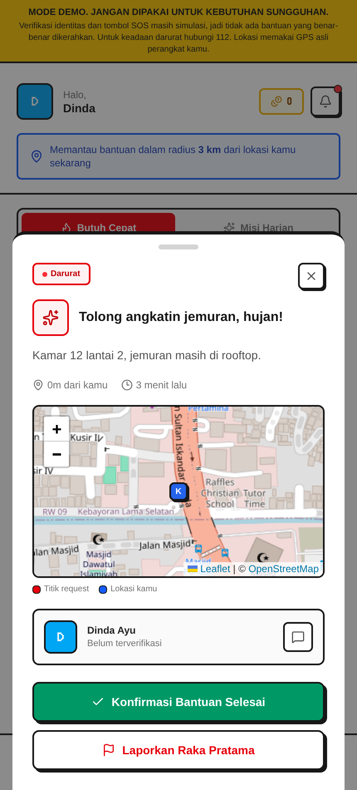 |

| Hapus request sendiri | Chat satu lawan satu | Lapor pengguna |
| --- | --- | --- |
| 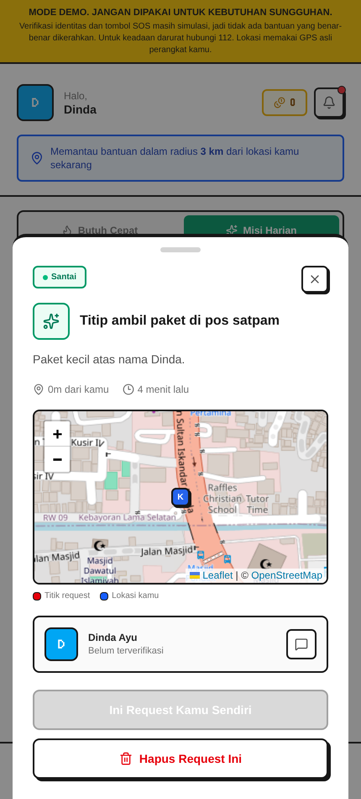 | 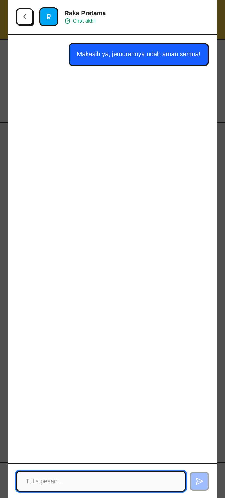 | 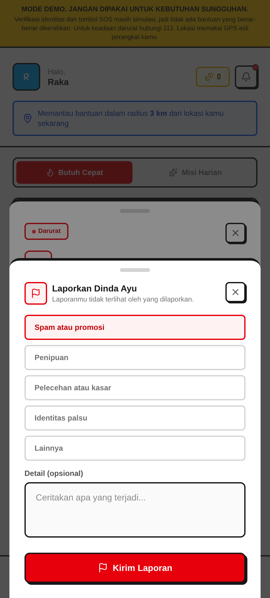 |

### Profil, notifikasi, dan darurat

| Profil dan Request Kamu | Riwayat, reward, peringkat | Panel notifikasi |
| --- | --- | --- |
| 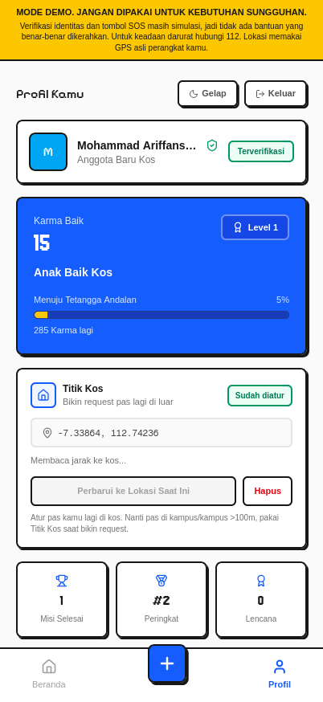 | 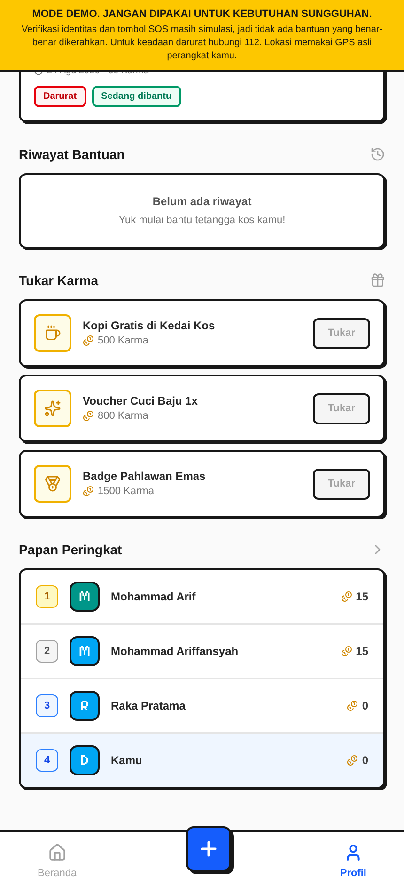 | 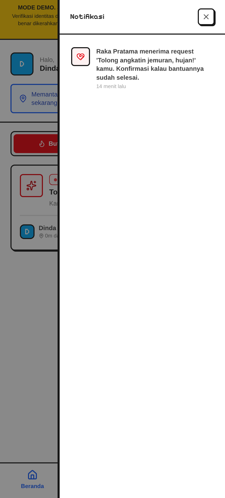 |

| Sinyal darurat | Mode gelap |
| --- | --- |
| 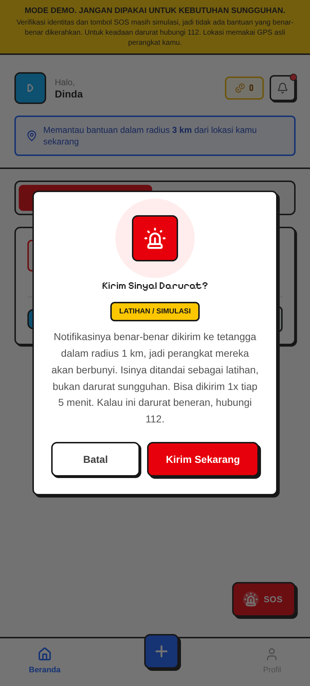 | 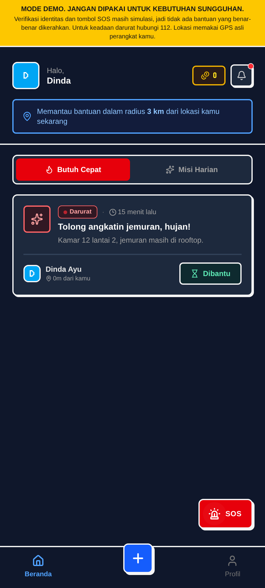 |

### Tampilan desktop

Pada lebar 1024 piksel ke atas, navigasi bawah berganti menjadi sidebar.

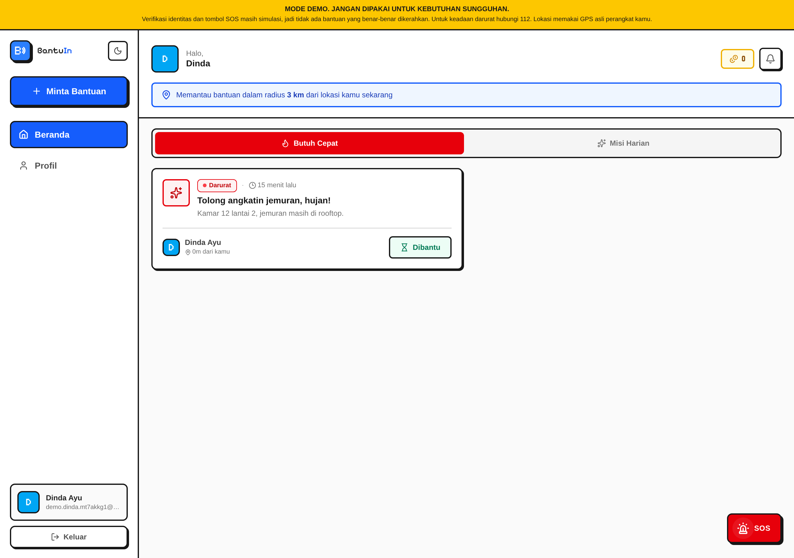

## Teknologi yang digunakan

| Bagian | Teknologi | Alasan pemakaian |
| --- | --- | --- |
| Framework | Next.js 16 dengan App Router dan Turbopack | Satu basis kode React, build development cepat, shell aplikasi bisa di-render statis |
| Library UI | React 19 | Model komponen yang dipakai di seluruh layar |
| Styling | Tailwind CSS 4 dengan `@tailwindcss/postcss` | Utility class menjaga tampilan neo brutalist tetap konsisten, mode gelap dikendalikan lewat class `dark` |
| Ikon | lucide-react | Satu set ikon untuk seluruh antarmuka, hanya ikon yang dipakai yang ikut ke bundle |
| Peta | Leaflet dengan tile OpenStreetMap | Perlu dua penanda sekaligus (titik request dan posisi kamu) plus zoom otomatis, yang tidak bisa dilakukan iframe embed OpenStreetMap. Tanpa API key, tile langsung dari `tile.openstreetmap.org` |
| Lokasi | Geolocation API browser | Posisi diambil dari GPS perangkat lewat `navigator.geolocation.watchPosition()` |
| Font | `next/font` dengan Geist, Pixelify Sans, Jersey 10 | Font di-host sendiri, tanpa layout shift, huruf piksel untuk judul dan angka skor |
| Backend | Supabase | Postgres, Auth, Realtime, dan row level security dalam satu layanan, tanpa server API terpisah |
| Klien database | `@supabase/supabase-js` v2 | Query bertipe, penanganan sesi auth, dan langganan realtime |
| Bahasa | TypeScript 5 | Tipe baris database dan model UI diperiksa saat build |
| Linting | ESLint 9 dengan `eslint-config-next` | Menangkap kesalahan khas React dan Next.js, termasuk penggunaan hook yang keliru |
| Package manager | pnpm 10 | Instalasi cepat dan resolusi dependensi yang ketat |

Aplikasi ini tidak punya server khusus. Semua operasi tulis dijalankan lewat
function Postgres di `supabase/schema.sql`, jadi aturan keamanannya berada
tepat di sebelah datanya.

## Fitur utama

### Feed bantuan berbasis jarak

Request tidak ditampilkan sebagai daftar global. Function
`nearby_help_requests` menerima koordinat pengguna, menghitung jarak ke setiap
request dengan rumus haversine, menyaring sampai radius tiga kilometer, lalu
mengurutkan dari yang terdekat. Koordinat pengguna lain tidak pernah keluar
dari database, yang dikirim hanya jaraknya dalam meter.

### Peta OpenStreetMap di detail request

Panel detail request menampilkan peta Leaflet dengan tile OpenStreetMap. Ada dua
penanda: titik merah untuk lokasi request, titik biru untuk posisi kamu, dengan
garis putus-putus di antaranya. Peta melakukan zoom otomatis ke kotak terkecil
yang memuat kedua titik, jadi sekali lihat sudah ketahuan arah dan jaraknya.
Kalau izin lokasi belum diberikan, peta cuma memusat ke titik request.

Koordinat request dikirim lewat kolom `request_lat` dan `request_lng`. Posisi
terakhir tiap pengguna, yang disimpan terpisah di `user_locations`, tetap tidak
pernah keluar dari database.

### Titik Kos untuk bikin request pas lagi jauh

Titik Kos adalah lokasi tetap kos kamu yang disimpan di `profiles.home_lat` / `home_lng` lewat `set_home_location(lat, lng)` dari tab Profil. Atur Titik Kos saat kamu lagi di kos, lalu pas kamu lagi di luar lebih dari 100 meter, modal Minta Bantuan memunculkan pilihan **Lokasi Saya** / **Titik Kos**. Jika Titik Kos dipilih, `create_help_request(..., p_use_home=true)` mengambil koordinat kos dari profil dan mengecek jarak GPS kamu ke kos di server dengan `haversine_m`. Jika jarak di bawah 100 meter request ditolak, jadi tidak bisa minta tolong padahal lagi di kos. Titik Kos bisa diperbarui atau dihapus dari Profil.

### Hapus request sendiri

Pembuat request bisa menghapus postingannya selama belum ada yang menerima.
Aturannya ada di function `delete_help_request`: hanya pemilik yang boleh
menghapus, dan request yang sudah diterima ditolak supaya Karma yang terlanjur
diberikan tidak menggantung. Lokasi dan chat ikut terhapus lewat foreign key
`on delete cascade`. Tombolnya ada di panel detail request dan di daftar
**Request Kamu** pada tab Profil, keduanya perlu dua kali tekan sebagai
konfirmasi.

### Daftar request sendiri di profil

Tab Profil punya bagian **Request Kamu** berisi semua request yang pernah kamu
buat, lengkap dengan tingkat urgensi, statusnya (menunggu bantuan, sedang
dibantu, selesai), nilai Karma, dan tombol hapus. Datanya diambil langsung dari
tabel `help_requests` berdasarkan `author_id`, jadi tetap lengkap walaupun kamu
sedang berada jauh dari lokasi request itu.

### Karma baru cair setelah dikonfirmasi

Menerima request tidak langsung membayar Karma. Alurnya tiga langkah:
penolong menekan **Terima**, statusnya jadi `accepted`, lalu pembuat request
menekan **Konfirmasi Bantuan Selesai** setelah bantuannya benar-benar diberikan.
Baru di langkah terakhir `complete_help_request` menulis catatan Karma, menambah
saldo penolong, dan mengirim notifikasi ke penolong.

Konfirmasi hanya bisa dilakukan oleh pembuat request, hanya kalau statusnya
`accepted`, dan hanya sekali. Baris request dikunci selama transaksi, jadi
menekan konfirmasi dua kali tidak membayar Karma dua kali. Nilai reward tetap
dihitung server dari tingkat urgensi, dan Karma dibelanjakan lewat transaksi
lain yang mengunci baris profil, sehingga double spending tidak mungkin.

### Tombol darurat berlabel latihan

Tombol SOS berjalan sebagai latihan, tapi notifikasinya sungguhan. Function
`send_panic_alert` menulis baris `panic_alerts` dan mengirim notifikasi ke akun
yang posisi terakhirnya berada dalam radius satu kilometer, jadi perangkat
tetangga terdekat benar-benar berbunyi. Judul notifikasinya diawali `[SIMULASI]`
dan `data`-nya membawa `simulated: true`, supaya penerima langsung tahu ini
bukan keadaan darurat sungguhan.

Radius satu kilometer dan cooldown lima menit per pengguna dijalankan di dalam
function database, bukan di antarmuka, jadi tetap berlaku walau permintaannya
dikirim manual. Layar konfirmasinya diberi label besar dan mengarahkan ke 112
untuk keadaan darurat sungguhan.

### Lapor pengguna

Setiap pengguna bisa dilaporkan lewat tombol bendera di panel detail request,
baik pembuat request maupun penolong yang sudah menerimanya. Laporan memilih
satu alasan (spam, penipuan, pelecehan, identitas palsu, atau lainnya) dengan
detail opsional maksimal 500 karakter, dan tersimpan di tabel `user_reports`
lewat function `report_user`.

Aturannya dijalankan di server: tidak bisa melaporkan diri sendiri, alasan harus
salah satu dari daftar, dan satu orang cuma bisa melaporkan orang yang sama
sekali per 24 jam supaya antrean moderasi tidak dibanjiri. Policy row level
security-nya membuat laporan hanya bisa dibaca oleh pelapornya sendiri, jadi
yang dilaporkan tidak pernah tahu siapa yang melapor.

### Chat pribadi satu lawan satu

Begitu sebuah request diterima, pembuat request dan penolongnya mendapat ruang
chat. Policy row level security di `chat_messages` hanya mengizinkan dua akun
itu untuk membaca dan menulis, diperiksa langsung ke baris request-nya.

### Pembaruan langsung

Feed, chat, dan panel notifikasi berlangganan Supabase Realtime, sehingga
request baru atau sinyal darurat muncul tanpa perlu memuat ulang halaman.

### Model data yang aman sejak awal

Semua tabel mengaktifkan row level security. Koordinat disimpan di dua tabel
terpisah yang sama sekali tidak diberi policy, artinya tidak ada client yang
bisa membacanya dalam kondisi apa pun. Dari `help_request_locations`, server
membocorkan titik request ke tetangga di dalam radius karena memang di situlah
bantuannya dibutuhkan; isi `user_locations` tidak pernah keluar sama sekali.
Titik Kos disimpan di `profiles.home_lat` / `home_lng` dan hanya dipakai server
untuk membuat request di kos saat kamu lagi jauh. Data identitas tidak
dikumpulkan: langkah verifikasi bersifat simulasi dan tidak menyimpan NIK, foto
KTP, maupun selfie.

### Antarmuka responsif dengan tema yang tersimpan

Tata letak berganti dari tampilan mobile dengan navigasi bawah yang menempel
menjadi tampilan desktop dengan sidebar pada lebar 1024 piksel. Pilihan tema
terang atau gelap disimpan di cookie `theme` dan dibaca root layout di server,
jadi kelas `dark` sudah menempel di HTML pertama dan halaman tidak pernah
berkedip ke tema yang salah. Konsekuensinya root layout dirender dinamis, bukan
statis.

## Cara instalasi

### Kebutuhan

- Node.js 20 atau lebih baru
- pnpm 10 (`corepack enable pnpm`)
- Project Supabase, paket gratis sudah cukup

### 1. Clone repositori dan pasang dependensi

```bash
git clone <url-repositori>
cd BantuIn-Private-Version
pnpm install
```

### 2. Buat schema database

1. Buka project Supabase, masuk ke **SQL Editor**, lalu **New query**.
2. Salin seluruh isi [`supabase/schema.sql`](supabase/schema.sql) ke editor.
3. Klik **Run**. Script ini idempotent, jadi aman dijalankan ulang setiap kali
   ada perubahan.

Script tersebut membuat tabel, policy row level security, function RPC,
publikasi realtime, dan data awal katalog reward.

### 3. Isi variabel lingkungan

Salin berkas contohnya:

```bash
cp .env.local.example .env.local
```

Isi nilainya dari **Project Settings > API** di dashboard Supabase:

| Variabel | Keterangan |
| --- | --- |
| `NEXT_PUBLIC_SUPABASE_URL` | URL project, contoh `https://abcd.supabase.co` |
| `NEXT_PUBLIC_SUPABASE_ANON_KEY` | Kunci anon public |

Keduanya dibaca saat server dinyalakan, jadi restart server development setelah
mengubah berkas ini.

### 4. Opsional: matikan konfirmasi email

Secara bawaan Supabase meminta pengguna baru mengklik tautan konfirmasi sebelum
bisa masuk. Untuk keperluan demo, matikan **Confirm email** di
**Authentication > Sign In / Providers > Email**. Kalau pengaturan itu
dibiarkan aktif, alur pendaftaran berakhir di layar "Cek Email Kamu" dan
pengguna baru bisa masuk setelah mengklik tautannya.

### 5. Izin lokasi

BantuIn membaca posisi dari GPS perangkat, bukan koordinat simulasi. Browser
hanya mengizinkan Geolocation API di *secure context*, yaitu `http://localhost`
atau domain HTTPS. Kalau aplikasi dibuka lewat HTTP biasa, izin lokasinya selalu
ditolak dan feed jatuh ke mode tanpa jarak.

## Cara penggunaan

### Menjalankan server development

```bash
pnpm dev
```

Buka <http://localhost:3000>, lalu izinkan akses lokasi saat browser bertanya.

### Perintah lain

```bash
pnpm build   # build produksi, sekaligus pemeriksaan TypeScript
pnpm start   # menjalankan hasil build produksi
pnpm lint    # menjalankan ESLint
```

### Alur pemakaian

1. Di layar sambutan, pilih **Daftar Sekarang**, lalu isi nama, email, dan kata
   sandi.
2. Jalankan langkah verifikasi simulasi. Tidak ada NIK atau foto yang diminta.
3. Izinkan akses lokasi saat browser bertanya. Feed beranda menampilkan request
   dari tetangga, diurutkan berdasarkan jarak, terbagi ke tab **Butuh Cepat**
   dan **Misi Harian**.
4. Buka tab **Profil** lalu atur **Titik Kos** saat kamu lagi di kos. Titik ini
   dipakai untuk bikin request pas kamu lagi jauh.
5. Tekan tombol tambah untuk membuat request, pilih tingkat urgensi dan
   **Titik Bantuan** (Lokasi Saya atau Titik Kos jika sudah diatur dan kamu
   lagi jauh lebih dari 100 meter), lalu kirim. Nilai Karma ditentukan server.
6. Tekan **Terima** pada request milik orang lain untuk mengambilnya dan
   mendapat Karma. Request buatan sendiri bertuliskan **Request Kamu** dan
   tidak bisa diterima.
7. Buka sebuah request untuk melihat detail, jarak, peta OpenStreetMap yang
   menunjuk titik tempat request itu dibuat, dan tombol chat yang muncul untuk
   kedua pihak yang terlibat.
8. Request buatan sendiri yang belum diterima bisa dihapus lewat tombol
   **Hapus Request Ini** di panel detailnya.
9. Tekan tombol merah **SOS** untuk menjalankan simulasi sinyal darurat.
10. Buka tab **Profil** untuk melihat level Karma, daftar **Request Kamu**,
    riwayat bantuan, papan peringkat, katalog reward, status Titik Kos, dan
    tombol ganti tema.

## Struktur proyek

```
app/
  layout.tsx                Layout root, font, skrip tema
  page.tsx                  Rute auth, state tema, kerangka responsif
  globals.css               Titik masuk Tailwind dan token desain
  _components/              Layar dan overlay
    WelcomeScreen.tsx       Layar sambutan
    LoginScreen.tsx         Formulir masuk
    RegisterFlow.tsx        Pendaftaran tiga langkah dengan verifikasi simulasi
    BantuInApp.tsx          Kerangka setelah login, state feed, realtime, modal
    HomeScreen.tsx          Feed request dan kartu request
    RequestDetailSheet.tsx  Panel detail request
    RequestMap.tsx          Peta OpenStreetMap untuk titik perkiraan request
    ChatOverlay.tsx         Chat satu lawan satu
    ProfileScreen.tsx       Karma, riwayat, papan peringkat, reward
    NotificationsPanel.tsx  Laci notifikasi
    AvatarBadge.tsx         Avatar inisial
    Logo.tsx                Logo dan lockup
  _lib/
    constants.ts            Metadata urgensi, tingkatan Karma, `HOME_NEAR_THRESHOLD_M`, `haversineM`, format teks
    types.ts                Tipe untuk lapisan UI termasuk `homeLat` / `homeLng`
    icons.ts                Pemetaan nama ikon ke komponen
    useIsDesktop.ts         Hook breakpoint lebar layar
    useGeolocation.ts       Hook GPS perangkat lewat Geolocation API
    supabase/
      client.ts             Klien Supabase untuk browser
      queries.ts            Jalur baca
      mutations.ts          Jalur tulis via RPC termasuk `set_home_location`, `clear_home_location`
      adapters.ts           Konversi baris database ke model UI
      types.ts              Tipe baris database termasuk `home_lat` / `home_lng`
supabase/
  schema.sql                Tabel, policy, function, data awal
docs/
  SUPABASE_SETUP.md         Panduan setup backend
  images/                   Logo dan tangkapan layar untuk README
```

## Cara kerja backend

Semua operasi tulis melewati function `security definer`, bukan insert atau
update langsung, sehingga nilai yang tidak boleh dikendalikan client tetap
ditentukan server.

| Aksi di antarmuka | Function atau tabel database |
| --- | --- |
| Daftar akun | `auth.users` dan trigger `handle_new_user` yang membuat baris `profiles` |
| Verifikasi identitas | `submit_identity_verification()` |
| Menyimpan posisi saat ini | `set_my_location(lat, lng)`, diisi dari GPS perangkat |
| Atur Titik Kos | `set_home_location(lat, lng)` dan `clear_home_location()` , disimpan di `profiles.home_lat` / `home_lng` |
| Memuat feed | `nearby_help_requests(lat, lng, radius, limit)` |
| Peta detail request | Kolom `request_lat` dan `request_lng` dari `nearby_help_requests` |
| Hapus request sendiri | `delete_help_request(request_id)` |
| Daftar request sendiri | Query `help_requests` difilter `author_id` |
| Membuat request | `create_help_request(title, description, urgency, lat, lng, p_use_home)` |
| Membuat request di Titik Kos | `create_help_request(..., p_use_home=true)` pakai Titik Kos + cek `haversine_m` >100m, ditolak jika masih dekat |
| Menerima request | `accept_help_request(request_id)` |
| Menukar reward | `redeem_reward(reward_id)` |
| Tombol darurat | `send_panic_alert(message, radius)`, notifikasinya diawali `[SIMULASI]` |
| Chat | Tabel `chat_messages`, terbatas untuk dua pihak yang terlibat |
| Notifikasi | Tabel `notifications`, hanya bisa dibaca pemiliknya |

Aturan sisi server yang tidak bisa dilewati antarmuka:

- Nilai reward diturunkan dari tingkat urgensi.
- Pengguna tidak bisa menerima request buatannya sendiri.
- Satu request hanya bisa diterima sekali, dijaga dengan penguncian baris.
- Satu pengguna maksimal membuat lima request per jam.
- Hanya pembuat request yang bisa menghapusnya, dan hanya selama statusnya masih
  `open`.
- Sinyal darurat bisa dikirim sekali per lima menit dan hanya sampai ke akun di
  dalam radius satu kilometer.
- Request di Titik Kos hanya bisa dibuat jika Titik Kos sudah diatur dan jarak GPS kamu ke Titik Kos lebih dari 100 meter, divalidasi di `create_help_request` di server.
- Koordinat disimpan di `help_request_locations` dan `user_locations` tanpa policy, dan di `profiles.home_lat` / `home_lng`. Yang keluar ke browser hanya jarak dalam meter dan titik request-nya sendiri.

## Bagian simulasi dan bagian nyata

Simulasi:

- **Verifikasi identitas.** Aplikasi tidak pernah meminta NIK, foto KTP, atau
  selfie, dan tidak menyimpan satu pun di antaranya. Badge terverifikasi adalah
  bagian dari simulasi produk, bukan hasil pemeriksaan identitas sungguhan.
  Versi produksi sebaiknya memakai penyedia verifikasi berizin daripada
  menampung dokumen identitas sendiri.
- **Tombol darurat.** Notifikasinya benar-benar terkirim ke tetangga dalam
  radius satu kilometer, tapi isinya ditandai `[SIMULASI]` dan tidak ada
  penanganan darurat sungguhan di baliknya: tidak ada eskalasi, tidak ada
  kontak petugas, tidak ada jaminan ada yang membaca.
- **Penukaran reward.** Karma benar-benar terpotong dan penukaran tercatat,
  tapi belum ada proses klaim atau pengiriman di baliknya.

Nyata:

- **Akun dan sesi** lewat Supabase Auth.
- **Lokasi.** Koordinat diambil dari GPS perangkat lewat Geolocation API browser
  (`app/_lib/useGeolocation.ts`), lalu disimpan di tabel yang tidak bisa dibaca
  client. Perhitungan jarak, penyaringan radius, dan radius sinyal darurat
  dijalankan di server memakai koordinat itu.
- **Peta.** Panel detail request memakai embed OpenStreetMap, bukan gambar
  tiruan, dengan penanda tepat di titik tempat request dibuat.
- **Karma, request, chat, dan notifikasi** tersimpan di Postgres dan
  dibagikan langsung antar pengguna.
- **Kontrol akses** lewat row level security, function `security definer`,
  perhitungan reward di server, batas jumlah request, aturan hapus request, dan
  cooldown sinyal darurat.

## Batasan yang diketahui

- Dua akun yang bekerja sama masih bisa menggelembungkan Karma dengan saling
  membuat lalu mengonfirmasi request palsu. Konfirmasi menutup celah "terima
  lalu kabur", bukan kolusi.
- Kalau penolong menghilang setelah menerima, request tersangkut di status
  `accepted`: pembuatnya tidak bisa menghapus dan tidak bisa mengonfirmasi.
  Belum ada tombol batalkan.
- Titik request terlihat persis oleh siapa pun di dalam radius tiga kilometer.
  Itu memang tujuannya supaya penolong bisa datang, tapi artinya lokasi kos
  pembuat request ikut terbaca. Hal yang sama berlaku untuk request yang dibuat
  lewat Titik Kos.
- Titik Kos butuh GPS aktif untuk menghitung jaraknya. Cek jarak lebih dari
  100 meter dijalankan di server, jadi tidak bisa di-bypass dari client. Tanpa
  Titik Kos, pilihan Titik Kos di modal tidak muncul.
- Laporan pengguna tersimpan di `user_reports` tapi belum ada antarmuka
  moderasi. Untuk sekarang laporannya dibaca lewat Table Editor di Supabase
  Dashboard. Blokir pengguna dan moderasi teks request maupun chat juga belum
  ada.
- Feed memuat maksimal 100 request tanpa penomoran halaman.
- Penukaran reward belum punya proses pemenuhan.
- Belum ada halaman syarat layanan dan kebijakan privasi.
- Peta menarik tile langsung dari `tile.openstreetmap.org`, jadi butuh koneksi
  ke sana, dan mode gelapnya cuma filter CSS di atas tile terang, bukan tile
  gelap sungguhan.
- Tanpa izin lokasi, feed tetap tampil tapi tanpa jarak dan tanpa urutan
  terdekat, dan request baru tidak bisa dibuat.
